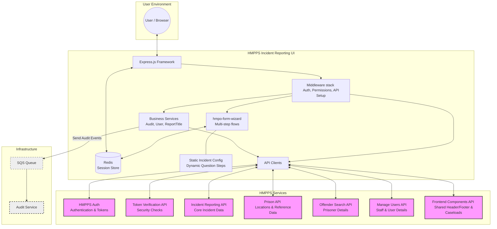

# Architecture

This document provides a logical overview of the HMPPS Incident Reporting UI's data flows and its interaction with other HMPPS services.

## Logical Data Flow

The following diagram illustrates how the application processes user requests, manages state, and integrates with external HMPPS APIs and infrastructure.

## Key Flows

### 1. Authentication and Authorization
1.  **Sign-in**: User is redirected to **HMPPS Auth** for login.
2.  **Token Exchange**: On return, the app exchanges an authorization code for access and refresh tokens.
3.  **User Context**: The app retrieves user details from **Manage Users API** and caseload information from **Frontend Components API**.
4.  **Permissions**: Middleware evaluates the user's roles and caseloads to determine access levels (e.g., READ, EDIT, APPROVE).

### 2. Incident Report Management
1.  **Dashboard**: Fetches incident reports from the **Incident Reporting API** filtered by user caseloads.
2.  **Creation Journey**: Uses `hmpo-form-wizard` to collect basic details and saves the initial report to the **Incident Reporting API**.
3.  **Involvements**:
    - Searches for prisoners via **Offender Search API**.
    - Searches for staff via **Manage Users API**.
    - Records involvements in the **Incident Reporting API**.
4.  **Dynamic Questions**:
    - Loads incident-specific question configurations from static files (generated from NOMIS/DPS data).
    - Dynamically generates wizard steps.
    - Saves question responses to the **Incident Reporting API**.

### 3. Shared UI Components
- The application fetches the common HMPPS header and footer from the **Frontend Components API** on every request. This ensures a consistent look and feel across all HMPPS digital services and provides up-to-date caseload switching capabilities.

### 4. Auditing
- Key user actions (e.g., viewing a report, submitting a change) trigger audit events.
- These events are sent to an **SQS queue**, which is then consumed by the HMPPS **Audit Service** for long-term storage and compliance monitoring.
